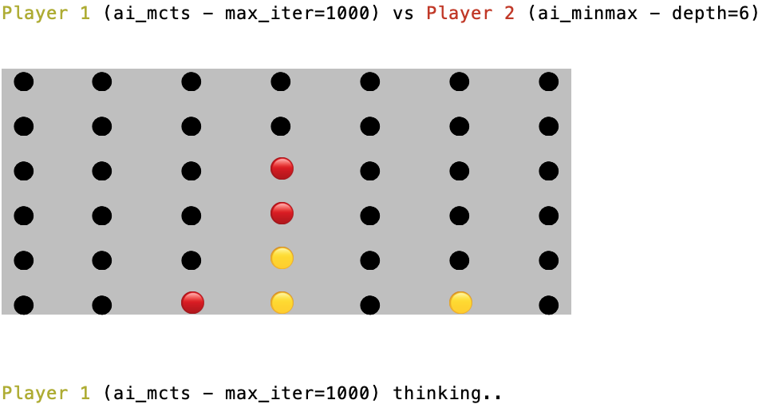

# Connect Four Master (co4m)
| Human lost!                                                | MCTS vs. MinMax                                                   |
|---------------------------------------------------------------|-------------------------------------------------------------------|
|  |  |


This program allows you to play the [Connect Four](https://en.wikipedia.org/wiki/Connect_Four) game in the terminal. 
It implements two AI players: a [Minmax](https://en.wikipedia.org/wiki/Minimax) player and a [Monte-Carlo Tree Search](https://en.wikipedia.org/wiki/Monte_Carlo_tree_search) (MCTS) search player.
You can play versus another human, one of the AI agent, or have two AI agents battle it out.

## Installation
Install the package by running in the main directory:
```
make install
```

## Playing
Launch the game via the entry point:
```
play-connect-four
```
or by executing `game.py` as a Python script.

## Details
I made this for my own fun -- there could be some glitches remaining. The minmax heuristic was inspired from [this paper](https://www.google.com/url?sa=t&rct=j&q=&esrc=s&source=web&cd=&cad=rja&uact=8&ved=2ahUKEwjkh564ksH_AhUaV6QEHSU1BFUQFnoECA8QAQ&url=https%3A%2F%2Fwww.researchgate.net%2Fpublication%2F331552609_Research_on_Different_Heuristics_for_Minimax_Algorithm_Insight_from_Connect-4_Game&usg=AOvVaw3hPgjlYXvwYrUEX30PaPiV) and is admiteddly not-so-great. By default, minmax will run with a depth of 6. MCTS will traverse the game's tree 1_000 times. Expect each agent to take a decision within 5 seconds.